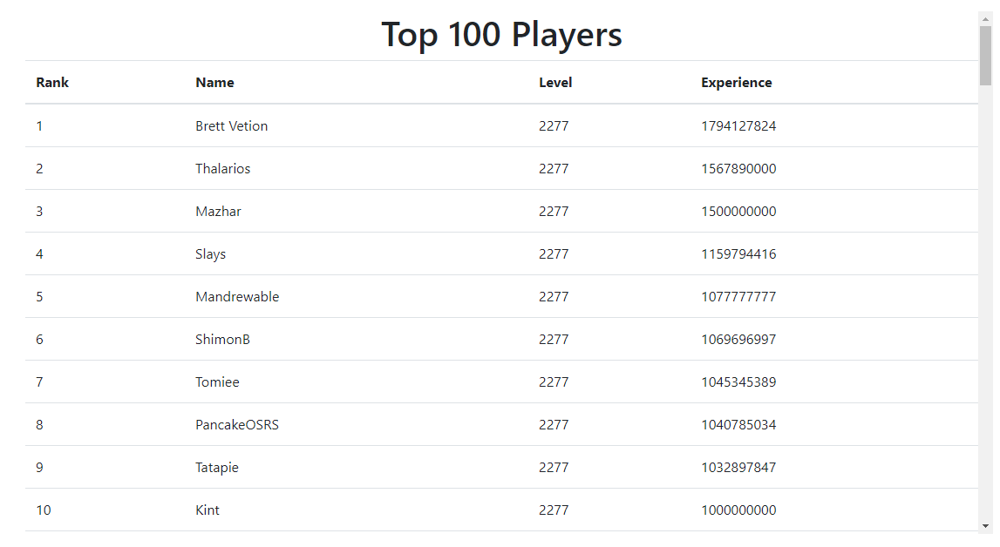

# Old School Runescape Twisted League Leaderboard Data Pipeline
A web scrape of https://secure.runescape.com/m=hiscore_oldschool_seasonal/overall for the purpose of tracking player progression through the seasons. There is no timeline for the next season.

## The list of results displayed in a table

## Data Pipeline

Seasonal league data is acquired from the [source](https://secure.runescape.com/m=hiscore_oldschool_seasonal/overall). A Python [script](scrape.py) scrapes the source, processes the data, and places it in a PostgreSQL database. 

## TODO
- Add more visuals to the web page
- Allow for the tracking of specific players
- Retrieve player stats via web crawler
- Add workflow to scrape every *n* days
